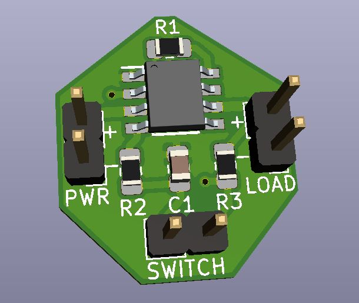

# Simple Soft Power Switch
A circuit for providing a power switch that latches, utilizing a momentary push button.

## Intro
This is a simple soft power switch that latches, using a momentary push button. It is found in many different devices from kids toys to consumer power supplies. I took apart an old electronic basketball hoop toy of my son's to reverse engineer the power switch circuit. This is circuit is cheap and simple, costing less than a bottle of Coke. From the datasheet, it can handle 5-18VDC with approximately 4 amps of current. This is a neat design to use in small projects where you want a momentary push button for powering on and off your device.

## Assembly / Install
* If used, the provided circuit board can be ordered from a PCB fabricator of your choice. (JLCPCB, PCBway, OSH Park, etc.)
* The components can be found from a wide variety of retailers. (Mouser, Digikey, RS, etc.)
* Solder the SMD components first. Pay attention to the orientation of the IRF7319.
* Solder the pin headers.
* Hook up a momentary switch to the SWITCH header.
* Hook up 5VDC to 18VDC to the PWR header.
* Hook up the device you want to power to the LOAD header.
* Press the momentary button once and your device turns on. Press it again and the device turns off.

## Note
With the provided PCB design with the small pin headers, use only low power IoT type devices. Don't melt your wiring and start a fire. This circuit is more intended to be used as an integration into other projects where you need a switched load.

## Misc
This project is open source. Feel free to do what you want with it.
